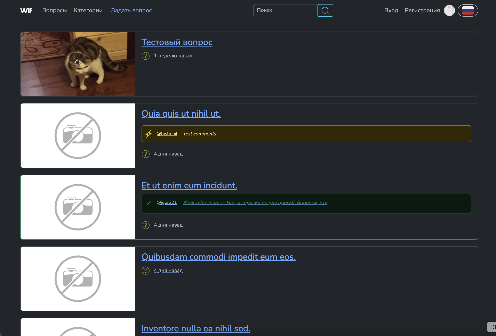
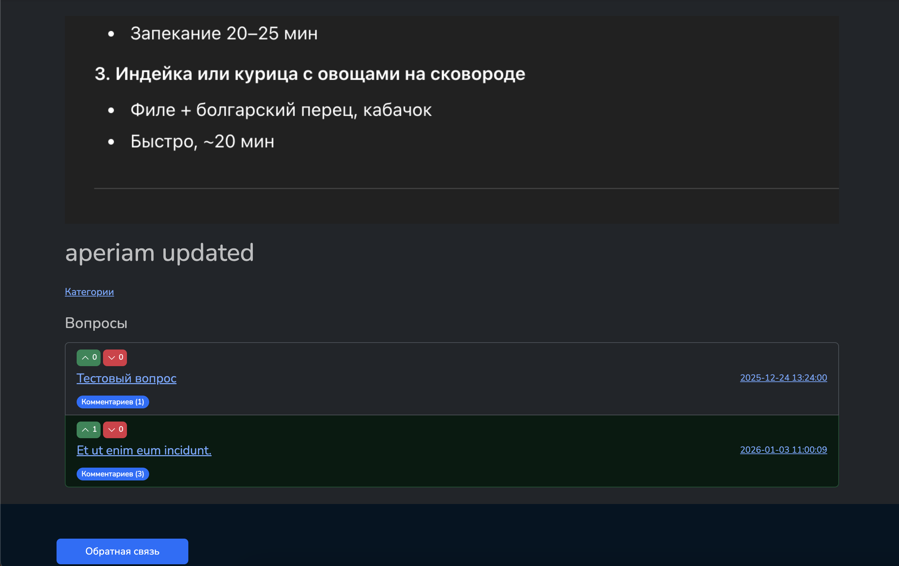

- Создание вопроса
    

    

- Страница списка вопросов
   
> Желтым отмечен наиболее популрный комментарий,
Зеленым отмечен комментарий который выбрал автор как ответ на свой вопрос

  

    

- Детальная страница вопроса + комментарии
  

    

- Детальная страница категории
  

    

