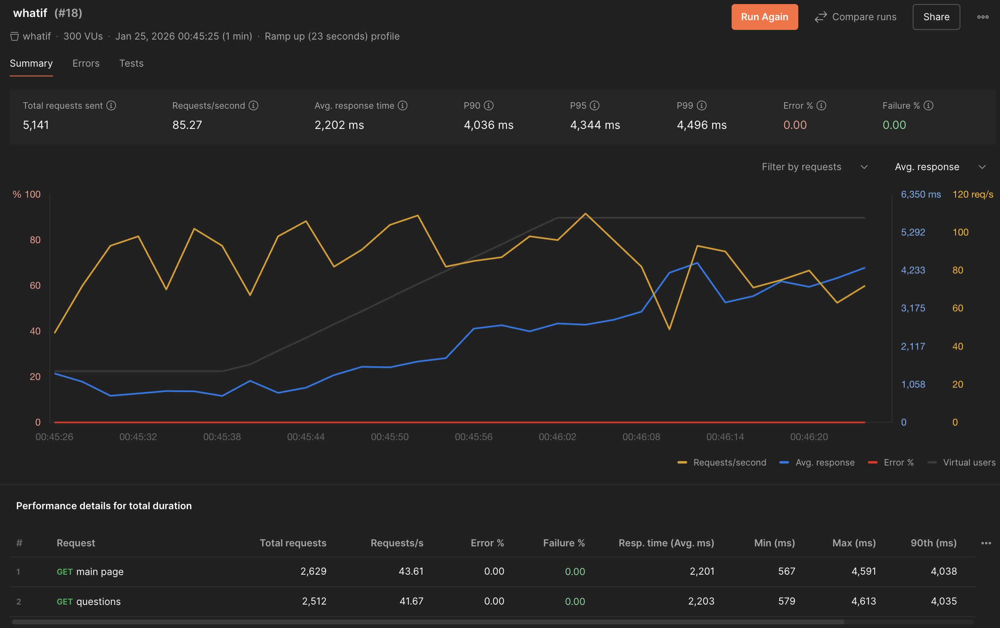
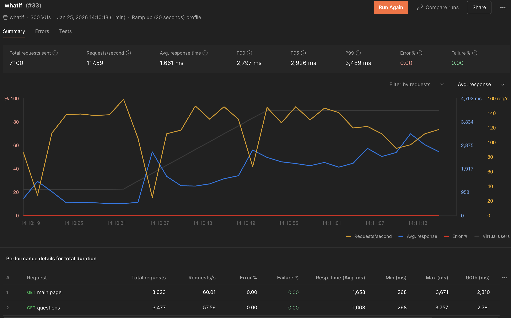
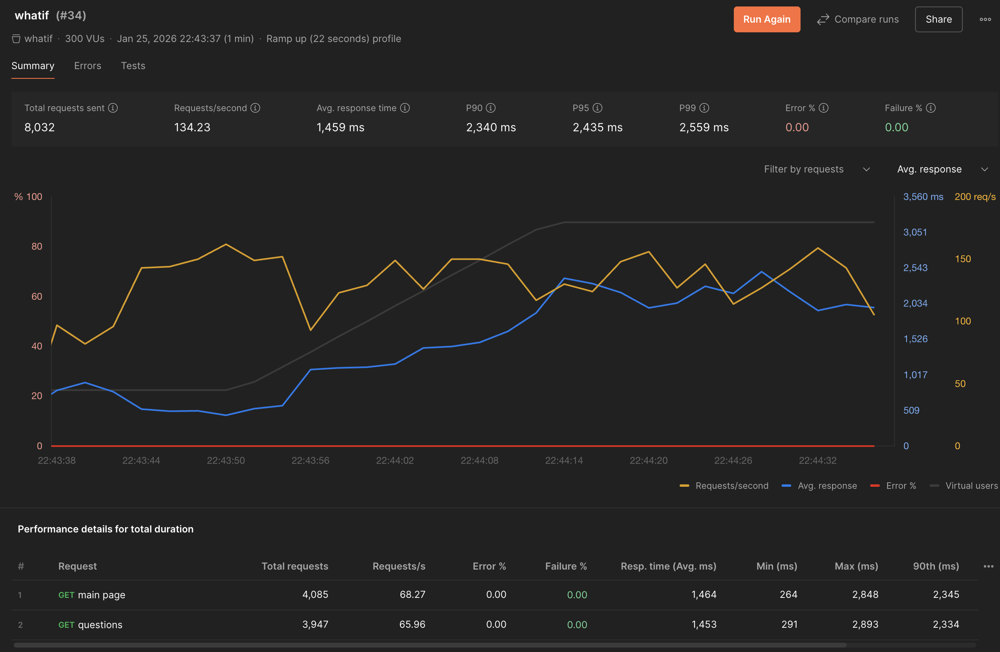

## Тесты 🔬

#### Для тестирования использовался Postman (Перфоманс тестирование)
- test 18

    

  

- test 33 (Установлен кастомный php-fpm конфиг)

    

  

- test 34 (Редис как хранилище сессий)

    

