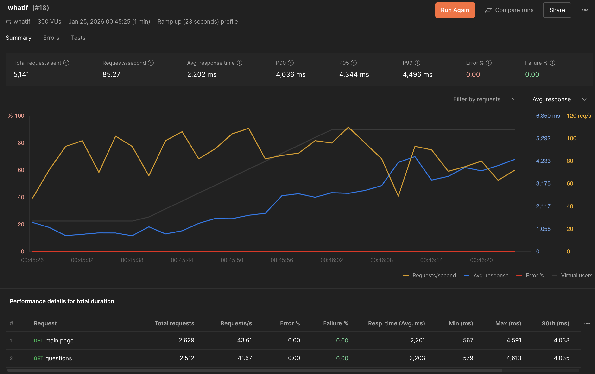
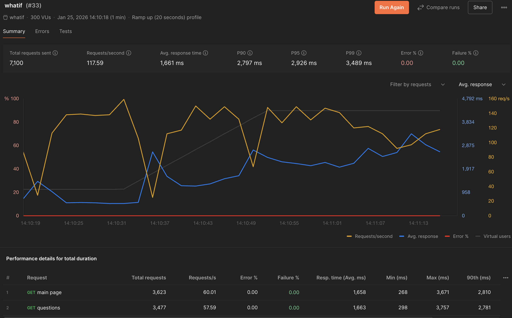
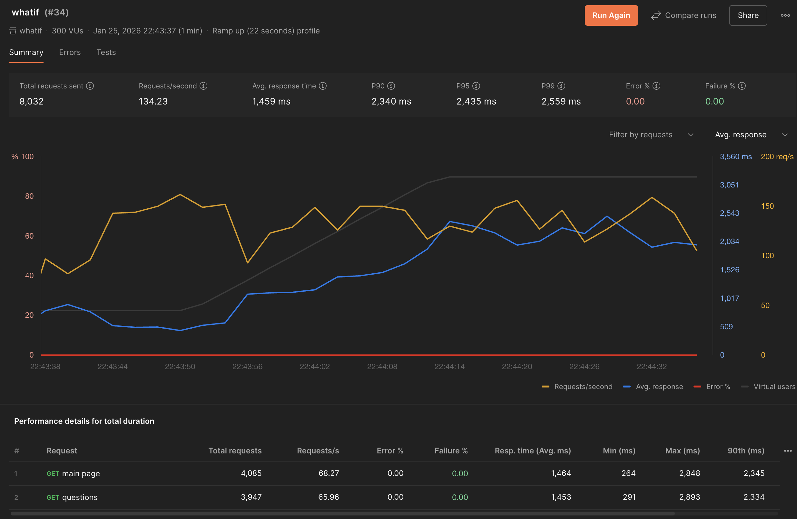
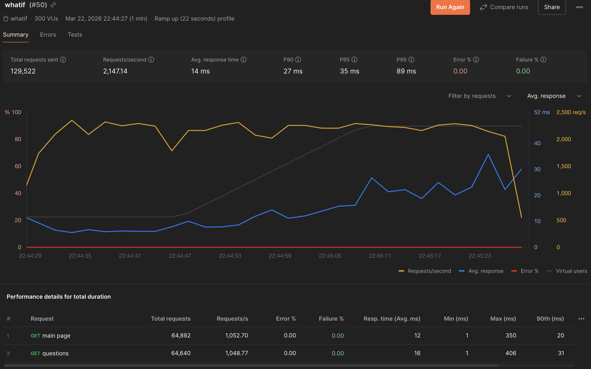

## Тесты 🔬

#### Для тестирования использовался Postman (Перфоманс тестирование с наращиванием, 300 юзеров)
- test 18

    

  

- test 33 (Установлен кастомный php-fpm конфиг)

    

  

- test 34 (Редис как хранилище сессий)

    

- test 50 (убран проброс папок - volumes)

    

